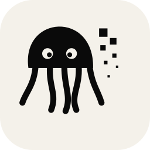

<p align="center"></p>

# Obfusk8 — anonymisation automatique de documents

🇫🇷 Français | 🇬🇧 [English](./README.en.md)

Outil d'anonymisation de documents (PDF, DOCX, CSV et images PNG/JPEG) auto-hébergé, conçu pour tourner entièrement en local — aucune donnée n'est envoyée à un service tiers. Détecte et caviarde les informations personnelles (noms, dates, identifiants, adresses...) via [Presidio](https://github.com/microsoft/presidio), avec une étape de révision humaine avant validation finale.

> ⚠️ **Avant de déployer cet outil sur des documents réels contenant des données sensibles**, lisez impérativement [`SECURITE.fr.md`](./SECURITE.fr.md) — il détaille les protections en place, les limites connues et les points qui restent sous votre responsabilité (certificat TLS, pentest, supervision).

## Sommaire

- [Fonctionnalités](#fonctionnalités)
- [Prérequis](#prérequis)
- [Démarrage rapide](#démarrage-rapide)
- [Configuration](#configuration)
- [Authentification (SSO / OIDC)](#authentification-sso--oidc)
- [Personnalisation](#personnalisation)
- [Sécurité](#sécurité)
- [Limites connues](#limites-connues)
- [Mises à jour et versions](#mises-à-jour-et-versions)
- [Licence](#licence)

## Fonctionnalités

- Anonymisation de **PDF, DOCX, CSV et images (PNG/JPEG avec OCR)**.
- Détection par NER (Presidio) + reconnaisseurs personnalisés (identifiants métier), avec thèmes de détection configurables (ex. thème médical).
- **Écran de révision humaine** avant finalisation : chaque détection peut être acceptée, ignorée, ou complétée manuellement.
- Purge complète des métadonnées et des objets résiduels à la sauvegarde (métadonnées EXIF/PDF, objets PDF orphelins, entrées DOCX non référencées).
- Authentification déléguée via un fournisseur OIDC standard (compatible Keycloak, Entra ID, Okta...).
- Fonctionne **100 % hors ligne** après l'installation initiale — aucune dépendance réseau sortante pour le traitement des documents.

## Prérequis

- **Docker** ≥ 24.0 et **Docker Compose** ≥ v2.20 (plugin `docker compose`, pas l'ancien `docker-compose` autonome).
- Un serveur/VM avec au minimum **4 vCPU / 8 Go de RAM** pour un usage ponctuel ; voir [`SECURITE.fr.md`](./SECURITE.fr.md#limites-connues-et-risques-acceptés) pour un usage multi-utilisateurs.
- Un **fournisseur d'identité OIDC** accessible (Keycloak, Entra ID, Okta, ou équivalent) — l'application ne fonctionne pas sans authentification déléguée.
- Un **nom de domaine ou entrée DNS interne** pointant vers le serveur (un certificat TLS valide sera nécessaire pour tout usage au-delà d'un lab, voir [Limites connues](#limites-connues)).

## Démarrage rapide

Pour un lab ou pour tester vous pouvez aussi suivre le document plus complet: [`deploiement-lab.md`](./deploiement-lab.md)

```bash
git clone https://github.com/EpicFail20/obfusk8.git
cd obfusk8

cp env.fr.example .env
# éditez .env avec vos propres valeurs (voir section Configuration ci-dessous)
./generate-secrets.sh

# Les images construites depuis ce dépôt (app, analyseur) se construisent
# localement ; les images tierces sont épinglées par condensat et tirées.
docker compose -f docker-compose.yml -f docker-compose.build.yml build
# Laboratoire : ajoutez --profile lab (Keycloak de laboratoire, mode développement,
# jamais en production) ou mettez COMPOSE_PROFILES=lab dans .env.
docker compose up -d
```

Vérifiez que tout tourne :

```bash
docker compose ps
docker compose logs -f app
```

Rendez-vous ensuite sur `https://<votre-domaine>` — vous devriez être redirigé vers votre fournisseur d'identité avant d'accéder à l'application.

## Configuration

Toute la configuration passe par le fichier `.env`, à copier depuis [`env.fr.example`](./env.fr.example) (ou [`env.en.example`](./env.en.example)) puis à remplir. **Ne committez jamais votre `.env` réel** — il est exclu par `.gitignore`.

Chaque variable est documentée directement dans `env.fr.example`. Les grandes catégories :

| Catégorie | Ce qu'elle contrôle |
|---|---|
| `APP_DOMAIN`, `OAUTH2_PROXY_*` | Domaine de l'application et connexion au fournisseur OIDC |
| `MAX_*` | Plafonds de taille/volume (upload, pages, lignes, durée de détection...) — protègent contre les documents surdimensionnés ou malveillants |
| `AV_*`, `ICAP_*` | Scan antivirus optionnel, via un serveur ICAP déjà déployé dans votre infrastructure |
| `ALERT_SINK`, `SYSLOG_HOST` | Envoi d'alertes de supervision vers votre SIEM/collecteur syslog |
| `ENABLE_EXTENSION_API`, `MAX_TEXT_*` | API texte pour une future extension de navigateur (analyse et pseudonymisation de prompts), **désactivée par défaut** — voir [`docs/api-extension.md`](./docs/api-extension.md) |

Les plafonds `MAX_*` ont des valeurs par défaut sûres pour un usage standard ; ne les augmentez qu'en connaissance de cause (voir [`SECURITE.fr.md`](./SECURITE.fr.md)).

## Authentification (SSO / OIDC)

L'application ne gère jamais elle-même les mots de passe : toute l'authentification passe par `oauth2-proxy`, configuré pour parler à n'importe quel fournisseur OIDC standard.

### Exemple avec Keycloak (test ou lab)

1. Démarrez Keycloak seul : `docker compose --profile lab up -d keycloak traefik` (Keycloak de **laboratoire** uniquement, en mode
   développement : jamais pour un pilote ni en production, voir `deploiement-lab.md`, « Déploiement réel »)
2. Ouvrez la console d'administration, créez un realm dédié.
3. Créez un client OIDC confidentiel, avec comme redirect URI :
   `https://<votre-domaine>/oauth2/callback`
4. Ajoutez un mapper *Group Membership* → claim `groups` si vous souhaitez restreindre l'accès par groupe.
5. Récupérez le *client secret* généré et placez-le dans le secret Docker `secrets/oauth2_client_secret.txt`, **jamais** dans `.env`
   (une variable `OAUTH2_PROXY_CLIENT_SECRET` dans `.env` prendrait le pas sur le secret Docker) ; voir `deploiement-lab.md`, étape 5.7.

### Basculer vers un fournisseur d'entreprise (Entra ID, Okta...)

Aucune ligne de code à modifier. L'identifiant du client va dans `.env`, le secret du client dans le secret Docker, **jamais** dans
`.env` :

```
# .env
OAUTH2_PROXY_CLIENT_ID=<client-id-de-votre-fournisseur>
```

```bash
printf '%s' '<client-secret-de-votre-fournisseur>' > ./secrets/oauth2_client_secret.txt
```

et dans `oauth2-proxy/oauth2-proxy.cfg`, le fournisseur (`provider`), l'URL d'émetteur (`oidc_issuer_url`) pointée vers votre tenant et le
groupe autorisé (`allowed_groups`). Démarrage sans le profil `lab` et accès sortant limité au fournisseur : voir `deploiement-lab.md`,
« Déploiement réel ». Exemple pour Entra ID :
`https://login.microsoftonline.com/<tenant-id>/v2.0`

## Personnalisation

Le comportement de détection est piloté par des **thèmes** (dossier `themes/`), chacun définissant les types d'entités à exclure ou les reconnaisseurs additionnels propres à un contexte métier (un thème médical est fourni en exemple). Voir [`docs/personnalisation.md`](./docs/personnalisation.md) pour créer votre propre thème.

## Sécurité

Ce projet a fait l'objet d'un audit de sécurité approfondi et itératif, dont le résumé public — protections en place, principes de conception, limites connues et recommandations avant mise en production — est disponible dans [`SECURITE.fr.md`](./SECURITE.fr.md).

Si vous découvrez une vulnérabilité, merci de la signaler de façon responsable plutôt que de la publier directement — voir [`SECURITE.fr.md#signaler-une-vulnérabilité`](./SECURITE.fr.md#signaler-une-vulnérabilité).

## Limites connues

- **Certificat TLS** : le déploiement de référence utilise un certificat auto-signé, adapté à un lab uniquement. Un certificat de confiance est indispensable avant toute mise en production.
- **Dimensionnement** : le dimensionnement (vCPU/RAM, nombre de réplicas Presidio) n'a pas été validé par un test de charge réel dans toutes les configurations — à valider dans votre propre environnement avant un usage à plusieurs dizaines d'utilisateurs simultanés.
- **Qualité de détection** : comme tout système basé sur du NER, la détection n'est pas garantie exhaustive à 100 % — l'écran de révision humaine avant validation est une étape volontairement obligatoire, pas une formalité.
- **Scan antivirus et supervision** : les intégrations (ICAP, syslog/SIEM) sont prêtes mais désactivées par défaut — elles nécessitent une infrastructure déjà existante côté déploiement pour être activées.
- **Pentest externe** : recommandé avant tout traitement de données réelles sensibles, en complément de l'audit interne déjà mené.

## Mises à jour et versions

Ce projet suit le [versionnage sémantique](https://semver.org/lang/fr/). Consultez les [Releases GitHub](../../releases) pour l'historique des versions. À chaque étiquette git `vX.Y.Z`, le workflow publie deux images, `ghcr.io/epicfail20/obfusk8-app` et `ghcr.io/epicfail20/obfusk8-presidio-analyzer`, sous les étiquettes `X.Y.Z` et `sha-<commit>` (jamais `latest` ni `main`). `docker-compose.yml` les référence par condensat (`:X.Y.Z@sha256:…`), comme toutes les images tierces. La version en cours de développement, `0.2.0-dev`, n'est construite que localement (`docker-compose.build.yml`) et n'est pas publiée.

Les dépendances (paquets Python, images de base et tierces) se mettent à jour selon la procédure de [maintenance des dépendances](docs/maintenance-dependances.md) : inventaire à la source, lots testés sous seccomp, garde-fou de détection, retour arrière, cadence proposée.

## Licence

This project is licensed under the GNU Affero General Public License v3.0 (AGPL-3.0).
See [LICENSE](./LICENSE) for details.
