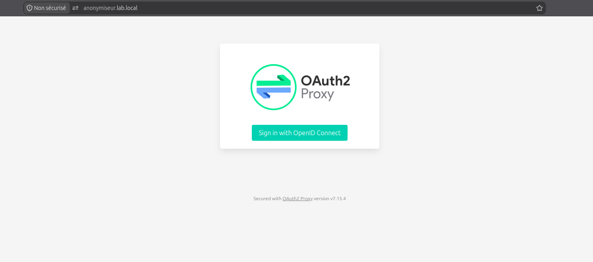
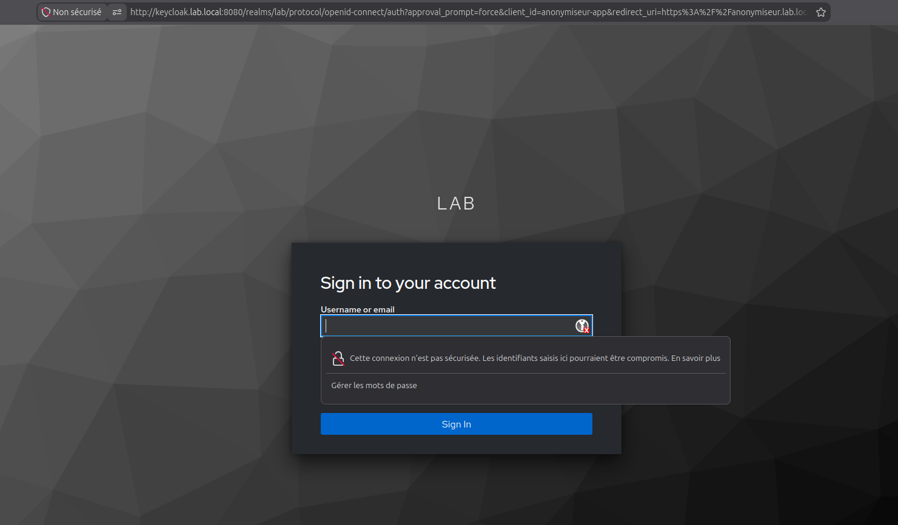
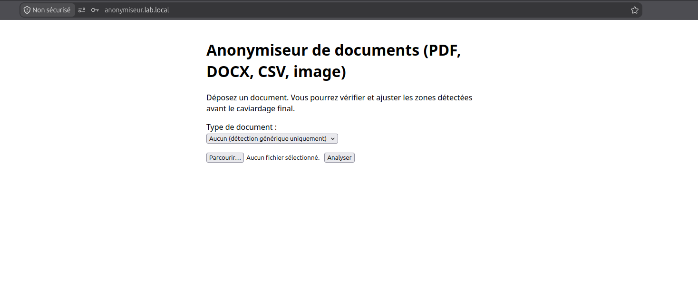
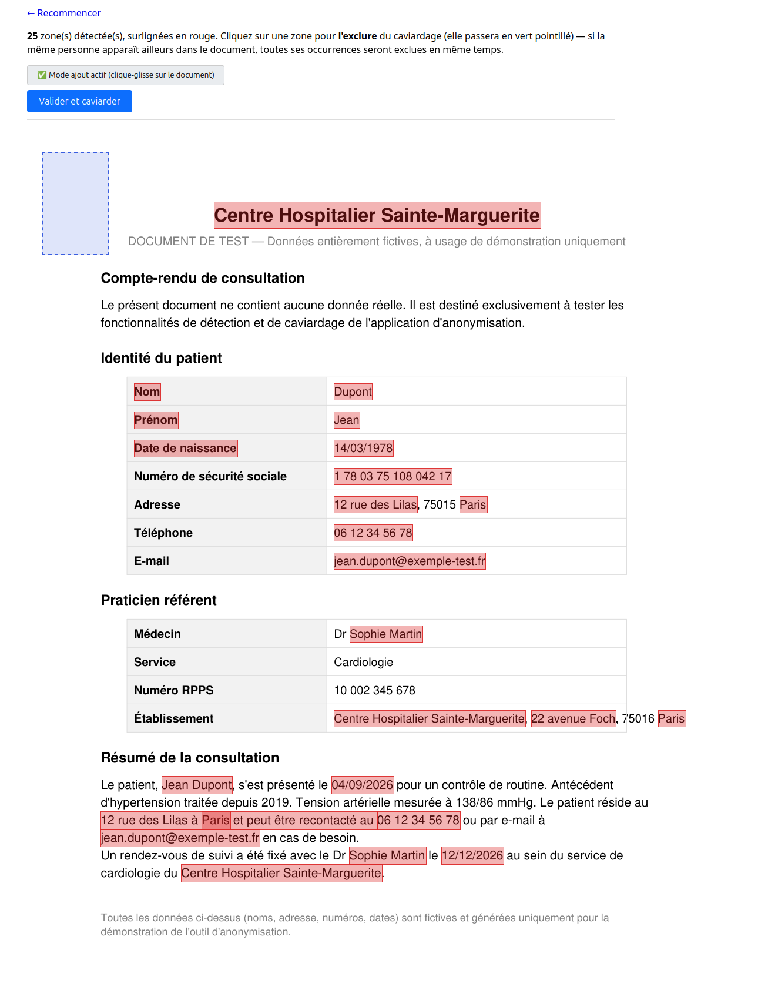
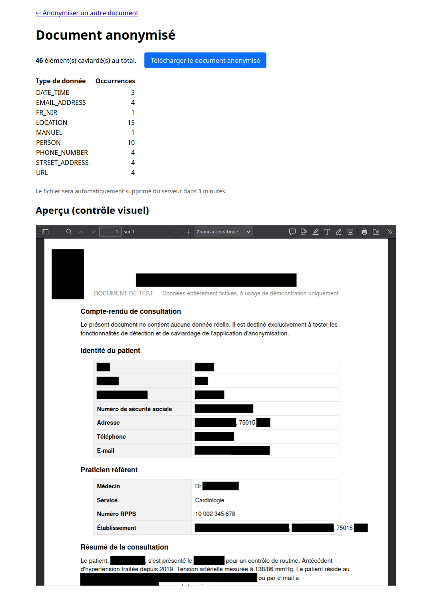
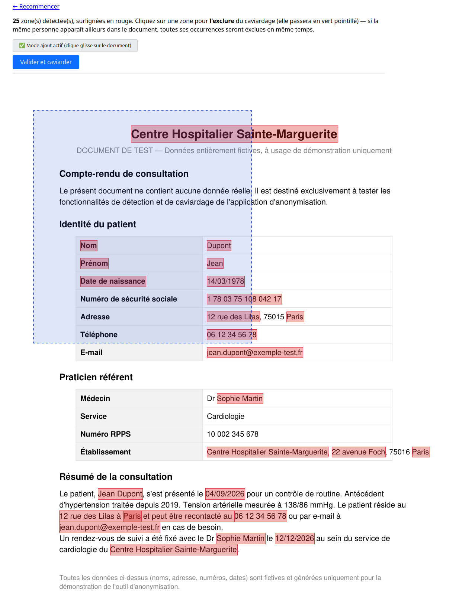
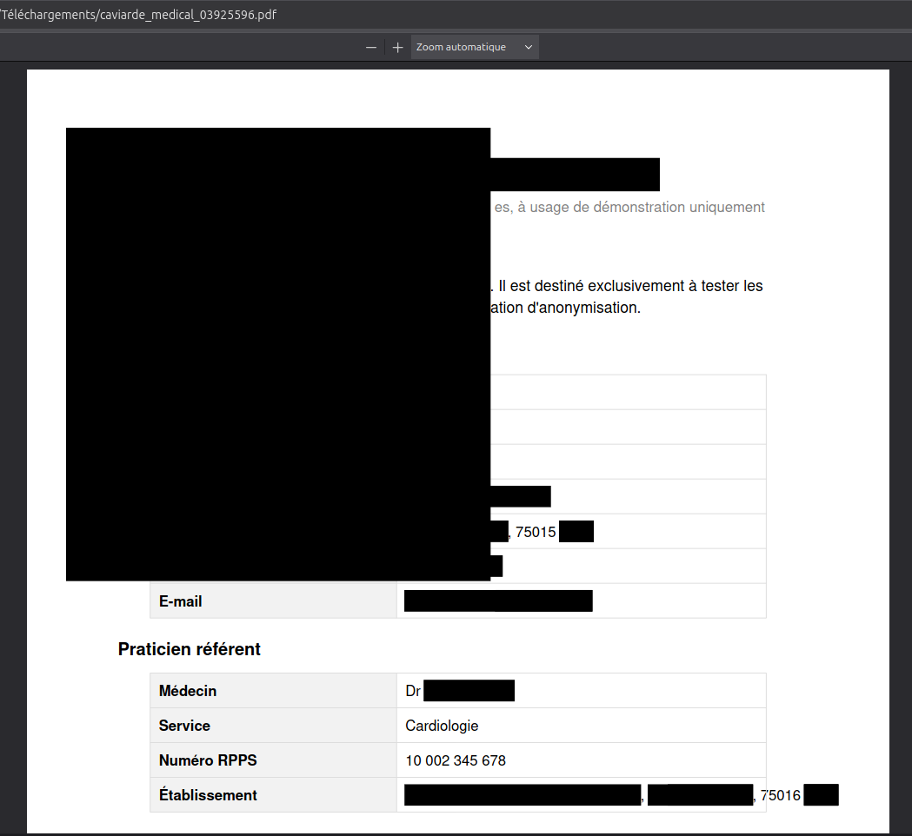

# Guide utilisateur — Anonymiseur de documents

🇫🇷 Français | 🇬🇧 [English](./user-guide-en.md)

Ce guide explique comment utiliser l'application d'anonymisation de documents, du dépôt du fichier jusqu'au téléchargement de la version anonymisée.

## Vue d'ensemble

L'application détecte et masque automatiquement les informations personnelles ou sensibles dans un document — au format PDF, Word (.docx), CSV ou image (PNG/JPEG) — avec une étape de révision humaine **obligatoire** avant la génération du fichier final : aucun document ne peut être téléchargé sans validation explicite d'un utilisateur.

## 1. Se connecter

Rendez-vous sur l'adresse de l'application et connectez-vous avec vos identifiants professionnels (SSO). 

Ici c'est keycloak qui est utilisé comme gestionnaire d'identité:

## 2. Importer un document

Sur l'écran d'accueil, cliquez sur « Choisir un fichier » ou glissez-déposez votre document dans la zone prévue. Les formats acceptés sont : PDF, Word (.docx), CSV et image (PNG/JPEG/JPG). 

## 3. Vérifier et valider les zones détectées (révision humaine obligatoire)

Une fois le document analysé, les informations personnelles détectées automatiquement apparaissent surlignées (zones sur l'aperçu pour un PDF ou une image, éléments mis en évidence dans le texte pour un DOCX ou un CSV). Cliquez sur une zone pour l'exclure du caviardage si elle a été détectée à tort. Cette étape n'est pas optionnelle : la détection automatique n'étant jamais garantie exhaustive, un humain doit visualiser et valider explicitement le résultat avant que le document ne puisse être généré. 

## 4. Ajouter une zone manuellement (PDF et images uniquement)

Pour les documents PDF et image, si une information sensible n'a pas été détectée automatiquement, activez le mode « ajout manuel » dans la barre d'outils, puis dessinez un rectangle directement sur le document à l'endroit à masquer. Cliquez sur une zone ajoutée pour la supprimer. Cette fonctionnalité n'est **pas disponible** pour les fichiers Word (.docx) et CSV, qui reposent uniquement sur la détection automatique et son exclusion manuelle. 

## 5. Générer et télécharger le document anonymisé

Une fois la révision terminée, cliquez sur « Valider » pour confirmer explicitement le contenu et générer le document final. Le fichier anonymisé est disponible au téléchargement pendant une durée limitée (quelques minutes) — pensez à le télécharger sans attendre. 

## Messages d'erreur courants

- Fichier refusé : seuls les formats PDF, DOCX, CSV, PNG et JPEG sont acceptés.
- Trop de tentatives : un délai s'applique si plusieurs documents sont envoyés très rapidement.
- Fichier expiré : si le téléchargement n'a pas été fait à temps, il faut relancer le traitement depuis le début.
